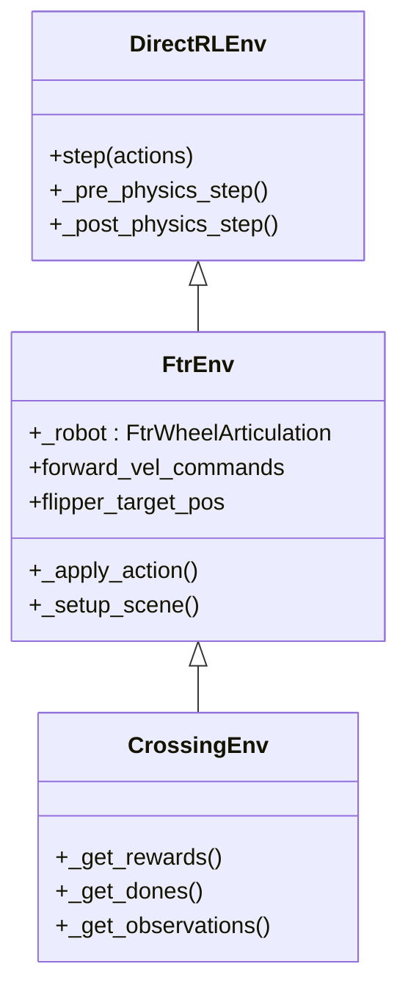

# FTR 环境架构总结

本文档总结了 FTR Benchmark 环境的架构，重点关注 `env.step(actions)` 的执行流程、`_apply_action` 的角色以及涉及 `CrossingEnv` 的类继承层次结构。

## 1. `env.step(actions)` 执行流程

`env.step(actions)` 是推进环境模拟一步的标准接口（Gymnasium/Gym）。在 Isaac Lab 的 `DirectRLEnv` 上下文中，它负责协调整个仿真循环：

1.  **物理前一步 (`_pre_physics_step`)**:
    *   **目的**: 将高层动作（例如神经网络输出或脚本命令）转换为底层的物理引擎指令。
    *   **动作**: 这通常是处理控制信号的地方。在 `FtrEnv` 中，此阶段负责协调速度指令和摆臂目标位置到机器人关节的应用。

2.  **物理仿真 (Physics Simulation)**:
    *   **目的**: 将物理引擎 (PhysX) 向前推进一段时间。
    *   **动作**: 仿真可能会执行多个子步（decimation）以确保物理稳定性。在此期间，执行器根据物理前一步中设定的目标驱动机器人。

3.  **物理后一步 (`_post_physics_step`)**:
    *   **目的**: 在物理演化后更新环境状态。
    *   **动作**: 
        *   从物理引擎刷新传感器缓冲区（位置、方向、速度）。
        *   计算智能体的观测值 (`obs`)。
        *   计算奖励 (`reward`)。
        *   检查终止条件 (`dones`)。

## 2. `_apply_action` 的角色

`_apply_action` 是 `FtrEnv` 中定义的一个专用方法，充当 **执行器映射层 (Actuator Mapping Layer)**。

*   **功能**: 它连接了抽象的控制变量和 USD/PhysX 关节。
    *   读取 `self.forward_vel_commands`（线速度/角速度目标）。
    *   读取 `self.flipper_target_pos`（摆臂/Flipper 关节角度）。
    *   如果配置了，则注入域随机化（噪声）。
    *   调用 `self._robot.set_v_w(...)` and `self._robot.set_all_flipper_position_targets(...)` 将这些值应用到具体的关节驱动器上。
*   **工作流**: 在重构后的 `display.py` 中，我们不再手动控制机器人。相反，我们更新环境的控制变量（`forward_vel_commands` 等）。`_apply_action` 确保在 step 循环期间不仅能将这些变量有效地“写入”物理引擎。

## 3. 与 `CrossingEnv` 的关系

这是一种 **继承与特化 (Inheritance and Specialization)** 的关系：

### `FtrEnv` (父类)
*   **职责**: **机器人本体 (Robot Embodiment)**。
*   **细节**: 
    *   定义机器人资产 (`_robot`, `FtrWheelArticulation`)。
    *   实现通用能力：`_setup_scene`（加载 USD）、`_apply_action`（电机控制）以及基本的状态获取。
    *   无论任务如何，它都代表“机器人本身”。

### `CrossingEnv` (子类)
*   **职责**: **任务逻辑 (Task Logic)**。
*   **细节**:
    *   **继承** 自 `FtrEnv`，自动获得所有机器人能力。
    *   针对特定挑战（场景：穿越地形）**特化**环境。
    *   **重写**:
        *   `_get_rewards`: 定义目标函数（例如，最大化前进进度，最小化惩罚）。
        *   `_get_dones`: 定义成功/失败标准（例如，到达目标，翻车）。
        *   `_get_observations`: 定义策略“看到”的内容（例如，高度图，机器人姿态）。

### 层次结构图

**总结**: 当您运行 `CrossingEnv` 时，您实际上是在运行一个 `DirectRLEnv` 循环，该循环使用 `FtrEnv` 的机制来移动机器人，并使用 `CrossingEnv` 的规则来评估表现。
